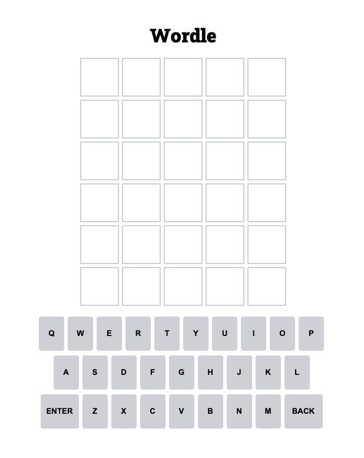
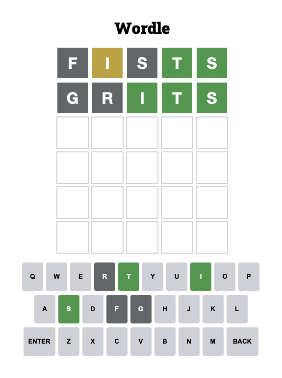
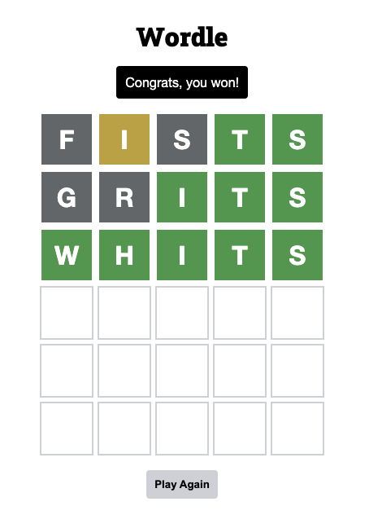

# Wordle

Guess the hidden word in 6 tries. Each guess must be a valid 5 letter word. After submitting your guess (ENTER), the tiles will change to green, yellow, or gray. 
- Green: The letter is in the correct spot
- Yellow: The letter is in the word, but in the wrong spot
- Gray: The letter is not in the word

## Play game: https://james-hudson-wordle.netlify.app/

## Game Images
Empty Game Board

Ongoing Game

Finished Game

## Wireframe

## Technologies Used 
- HTML
- CSS
- JavaScript

## Next Steps
1. Add a score counter
2. Add a streak counter
3. Add a dark mode

## Sources
1. Word list: https://www-cs-faculty.stanford.edu/~knuth/sgb-words.txt
2. Wordle Favicon: https://www.google.com/search?q=wordle+favicon&sxsrf=ALiCzsaBVWv-VOMUa_MEI7ZSlz3woLQ[…]98o36AhUCj4kEHfebAEoQ_AUoAXoECAEQAw&biw=1200&bih=1180&dpr=1.6

