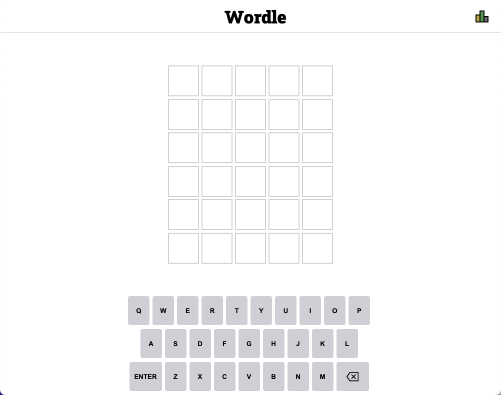
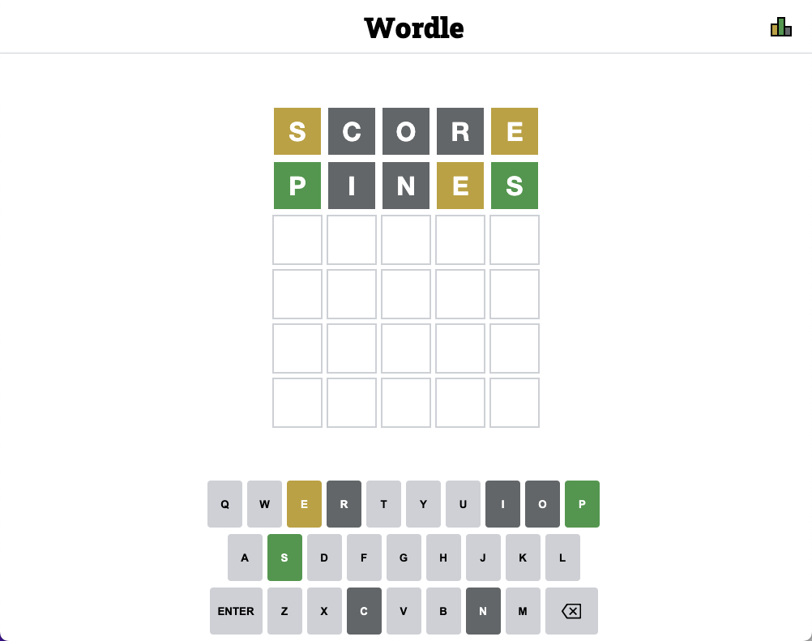
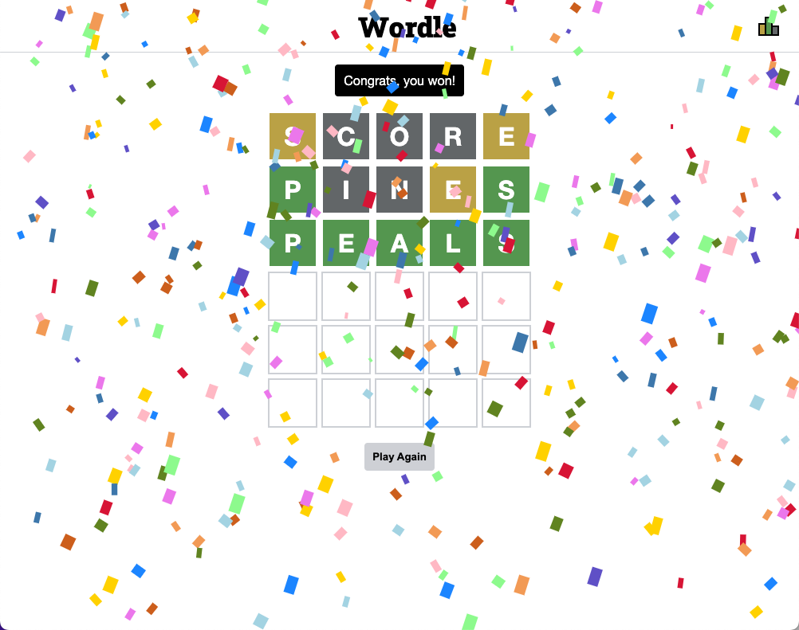

# Wordle
*Play the [Wordle](https://james-hudson-wordle.netlify.app/) game*

## Game Rules
Guess the hidden word in 6 tries. Each guess must be a valid 5-letter word. After submitting your guess, the tiles will change to green, yellow, or gray. 
- Green: The letter is in the correct spot
- Yellow: The letter is in the word, but in the wrong spot
- Gray: The letter is not in the word

## Planning Materials
### [Pseudocode](https://docs.google.com/document/d/1B1-6lsdafm1LRVMT_wPzDoH1kHZZG1LW2v_xrc0uLLk/edit)
### Wireframe

## Game Images
### Empty Game Board

### Ongoing Game

### Completed Game

## Technologies Used 
- HTML
- CSS
- JavaScript
- Figma

## Future Goals
1. Add a bar chart to the statistics modal that displays the win breakdown by number of guesses it took the user to guess the secret word.
2. Add a dark mode.

## Sources
1. [Word List](https://www-cs-faculty.stanford.edu/~knuth/sgb-words.txt)
2. [Wordle Favicon](https://static01.nyt.com/images/2022/03/02/crosswords/alpha-wordle-icon-new/alpha-wordle-icon-new-square320-v3.png?format=pjpg&quality=75&auto=webp&disable=upscale)
3. [Confetti](https://github.com/SEI-Remote/confetti/blob/main/confetti.js)
4. [Win Sound Effect](https://davidandshark.com/guessing-game/audio/kazoo.wav)
5. [Lose Sound Effect](https://www.youtube.com/watch?v=bceGNIg-rqI)